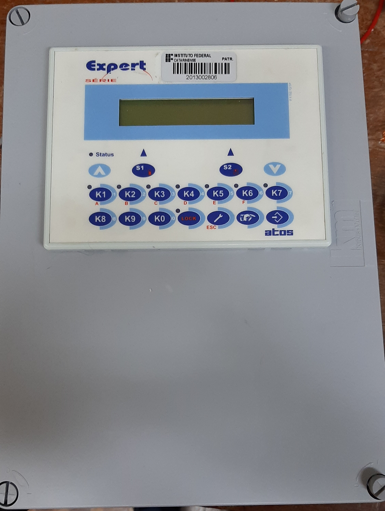
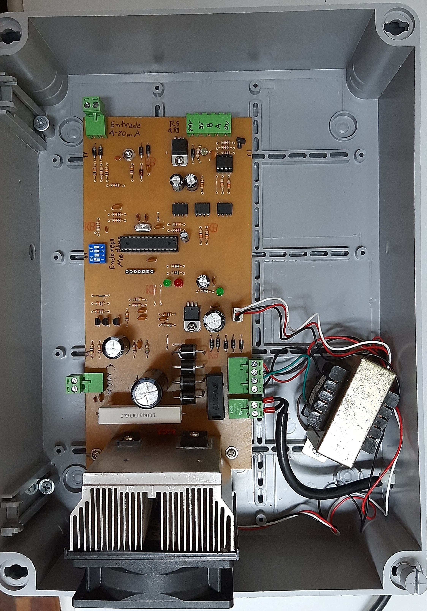
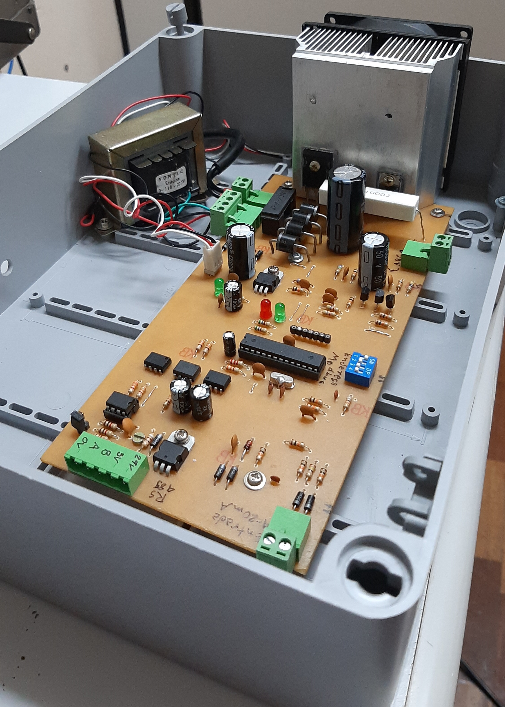

# Controlador de corrente CC

Projeto de um controlador de corrente CC 5A desenvolvido pelos técnicos do IFC - Campus Luzerna para ser utilizado nas disciplinas relacionadas com máquinas e acionamentos elétricos. O objetivo é utilizar esse controlador para acionar um freio acoplado diretamente a um motor de indução trifásico, criando assim um simulador de cargas. Assim, os alunos podem observar as diferentes características de acionamentos quando utilizados em diferentes situações.

Agradecimentos especiais vão para os colaboradores Clecio Jung, Darlan Klotz, Dionathan Luan de Vargas e Marcos Fiorin.

## Descritivo do projeto

Características do controlador de corrente:

- Hardware eletrônico desenvolvido no software Autodesk Eagle versão 9.6.2, e o projeto pode ser adquirido na pasta [circuito eletrônico](./circuito%20eletronico/);

- Firmware do microcontrolador ([Atmega8](https://ww1.microchip.com/downloads/en/DeviceDoc/Atmel-2486-8-bit-AVR-microcontroller-ATmega8_L_datasheet.pdf)) desenvolvido no software Microchip Studio versão 7.0, e os arquivos podem ser adquiridos na pasta [firmware](./firmware/);

- O controlador pode operar como escravo em rede Modbus RS-485:
    - O circuito de comunicação RS-485 é isolado e precisa de alimentação independente (5V ou 24V contínuos);
    - Código utilizado para implementar a comunicação provem da biblioteca [ModBus_RTU_Drivers](https://github.com/RicardoKers/ModBus_RTU_Drivers);
    - Endereço configurável através de chaves dip switch de quatro posições. O valor desejado para o endereço deve ser convertido para binário primeiro, e depois as chaves devem ser configuradas de acordo. Os endereços possíveis estão entre 0 e 15. O endereço 0 não corresponde a um endereço Modbus válido, e portanto, a comunicação Modbus é desabilitada, e o setpoint do controlador passa a ser definido pela entrada analógica 4-20mA (maiores detalhes abaixo).
    - A comunicação dispõe de três registradores de leitura e escrita (funções 3, 6 e 16 do protocolo Modbus):

| Endereço | Range      | Descrição |
| -------- | ---------- | --------- |
| 0        | 200 - 1000 | Valor amostrado da entrada analógica 4-20mA. O valor desse registrador é proporcional à corrente na entrada analógica, sendo que o valor 200 indica corrente de 4mA, e o valor 1000 indica corrente de 20mA. Caso a leitura nesse registrador indique valores inferiores a 200, a entrada está desconectada ou o cabo rompido. Escrever algum valor nesse registrador não terá efeito algum. |
| 1        | 0 - 1000   | Valor amostrado da corrente de carga. O valor desse registrador é proporcional à corrente na carga, sendo que o valor 0 indica 0A, e o valor 1000 indica 5A. Escrever algum valor nesse registrador não terá efeito algum. |
| 2        | 0 - 1000   | Referência (setpoint) de corrente. Segue o mesmo range de unidades do parâmetro anterior. Valor a ser escrito pelo mestre Modbus usado (caso esteja usando comunicação RS-485) |

- O controlador pode ainda receber a referência de corrente (setpoint) a partir da entrada analógica 4-20mA:
    - Para ativar essa opção, deve-se configurar as dip switch de configuração do endereço modbus no valor 0 (todas desabilitadas). Nesse caso, 4mA na entrada representam setpoint de 0A, e 20mA corresponde a referência de 5A. Valores inferiores a 4mA na entrada representam erro (provavelmente o cabo está rompido ou a entrada desconectada), e nesse caso o controlador desliga a carga e o led vermelho liga, indicando um erro;
    - O circuito da entrada analógica é isolado, não necesssita de alimentação independente e o sentido da corrente é arbitrario (funciona do mesmo jeito se a corrente na entrada analógica for positiva ou negativa);

- Quando o led vermelho na placa de circuito eletrônico estiver ligado, um erro ocorreu. Até o momento, apenas um erro é reportado:
    - Quando o setpoint é informado pela entrada analogica e o valor amostrado nessa entrada é inferior a 4mA (provavelmente o cabo está rompido ou a entrada desconectada);

- Na pasta [scada](./scada/) temos uma aplicação desktop simplista desenvolvida no software Elipse E3 (necessário instalá-lo para rodar a aplicação), onde a comunicação com o controlador já está implementada;
